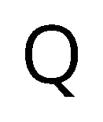
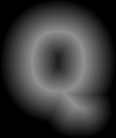

# msdf

`msdf` is a _Multi-channel signed distance field generator_ for fonts. It is _pure Rust_ and does not depend on the standard library (`no_std`).

## WIP (!)

- [x] Bitmap Rasterizing (scanline)
- [x] SDF Rasterizing
- [ ] MSDF Rasterizing
- [ ] SDF interpretation (convert to bitmap)
- [ ] MSDF interpretation (convert to bitmap)
- [ ] Improve Performance

## Example

```rust
const OUTLINE: u8 = 32;
const SCALE: f64 = 0.05;

// get font face & glyph
let font = include_bytes!("fonts/OpenSans-Regular.ttf");
let face = Face::from_slice(font, 0).unwrap();
let glyph_id = face.glyph_index('Q').unwrap();
// create a `Shape`
let mut shape_builder = Shape::<f64>::builder();
face.outline_glyph(glyph_id, &mut shape_builder);
let shape = shape_builder.finish().unwrap();

// create a target image
let width = ((shape.aabr().max.x - shape.aabr().min.x) * SCALE) as usize + 2 * OUTLINE as usize;
let height =
    ((shape.aabr().max.y - shape.aabr().min.y) * SCALE) as usize + 2 * OUTLINE as usize;
let mut image = GrayImage::new(width as u32, height as u32);

let rasterizer = Rasterizer::new().with_scale(SCALE).with_translate(
    -shape.aabr().min.x + OUTLINE as f64 / SCALE,
    -shape.aabr().min.y + OUTLINE as f64 / SCALE,
);

// rasterize shape to image as bitmap
rasterizer.rasterize_bitmap(&shape, width, height, |x: usize, y: usize, value: bool| {
    let value = if value { 0 } else { 255 };
    image.put_pixel(x as u32, y as u32, Luma([value]));
});
image.save("examples/out/simple_bitmap.png").unwrap();

// rasterize shape to the image as SDF
rasterizer.rasterize_sdf(
    &shape,
    width,
    height,
    OUTLINE,
    |x: usize, y: usize, value: u8| {
        image.put_pixel(x as u32, y as u32, Luma([value]));
    },
);
image.save("examples/out/simple_sdf.png").unwrap();
```

This will produce the following images:




### Attribution

Thanks [Chlumsky][chlumsky] for the great [C++ implementation][msdfgen] and your work on your Master's thesis.

[msdfgen]: https://github.com/Chlumsky/msdfgen
[chlumsky]: https://github.com/Chlumsky
[ttf-parser]: https://github.com/RazrFalcon/ttf-parser
